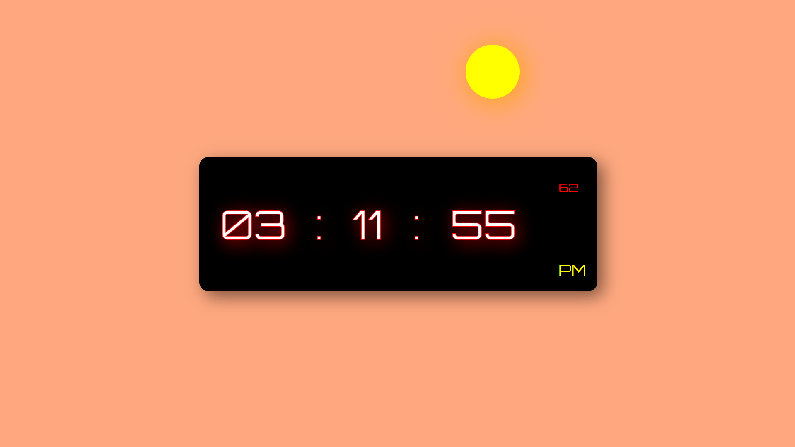

# Day-3-Digital-Clock-Vibe-coder

## 🌟 Features

- 🕒 Real-time digital clock (HH:MM:SS:MS)
- 🌗 Sun/Moon shape changes with time
- 🌅 Dynamic day & night background
- 💡 Glowing shadow effects with CSS
- ⚡ Smooth animated transitions

---

---

## 🔗 Useful Links

- 📁 [GitHub Repository](https://github.com/Boys43/Day-3-Digital-Clock-Vibe-coder.git)
- 🎥 [Watch Tutorial on YouTube](https://youtube.com/your-clock-video)
- 🔤 [Orbitron Google Font](https://fonts.google.com/specimen/Orbitron)

---

